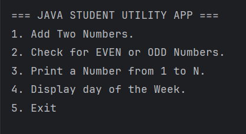
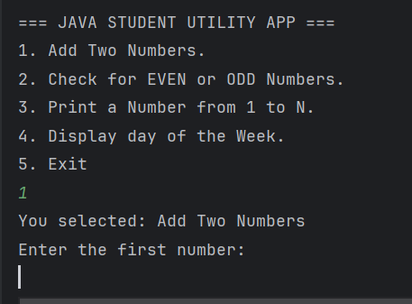
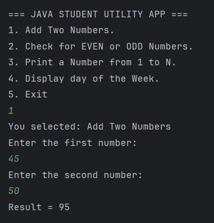

# === JAVA STUDENT UTILITY APP ===

## Overview
The **Java Student Utility App** is a console-based, menu-driven Java application designed to help beginners practice core Java programming concepts.  
The application allows users to interact with a simple menu and perform basic operations such as calculations, decision-making, and looping.

This project was developed as part of a **Week One Java Coding Task** and demonstrates foundational Java skills alongside proper Git and GitHub usage.

---

## Project Objectives
The main objectives of this project are to:

- Understand Java program structure
- Practice using variables and data types
- Apply arithmetic and logical operators
- Implement decision-making using `if-else` and `switch`
- Use loops (`for` and `do-while`)
- Write and call methods
- Handle user input using the `Scanner` class
- Follow a basic Git & GitHub workflow

---

## Technologies Used
- **Java (JDK 17)**
- **Git** for version control
- **GitHub** for repository hosting
- **IntelliJ IDEA** (IDE)

---

## Application Features

When the program starts, it displays a menu with the following options:

### 1. Add Two Numbers
- Prompts the user to enter two integers
- Adds the numbers using arithmetic operators
- Displays the result

### 2. Check EVEN or ODD 
- Prompts the user to enter a number
- Uses a ternary operator to determine if the number is EVEN or ODD
- Displays the result

### 3. Print Numbers from 1 to N
- Prompts the user to enter a number `N`
- Uses a `for` loop to print numbers from 1 to `N`

### 4. Display Day of the Week
- Prompts the user to enter a number between 1 and 7
- Uses a `switch` statement to display the corresponding day
- Displays an error message for invalid input

### 5. Exit
- Displays a thank-you message
- Terminates the application gracefully

---

## Program Flow Explanation

1. The program starts execution from the `main` method.
2. A menu is displayed to the user.
3. The user selects an option by entering a number.
4. Based on the selected option:
    - A specific method is called
    - The corresponding task is executed
5. The menu repeats until the user selects **Option 5 (Exit)**.
6. The program ends and releases system resources.

NB: A `do-while` loop is used to ensure the menu is displayed at least once.

---

## How to Run the Application

### Prerequisites
- Java Development Kit (JDK) installed
- Java IDE (IntelliJ)

### Steps
1. Clone the repository:
   ```bash
   https://github.com/Bemmanuel01/Java-WeekOne-Student-Utility-App

2. Navigate into the project directory:
   cd Java-WeekOne-Student-Utility-App
3. Compile the program:
javac StudentUtilityApp.java
4. Run the application:
   java StudentUtilityApp
---
## Sample Output
1. Menu of the app


2. Option Selection and Operations.
e.g Option 1 "Add Two Numbers."



- Kindly use other options from 1 to 5, to see the feature of this utility app.
---
## Key Concepts Demonstrated
- Menu-driven programming 
- Method decomposition
- Input handling with Scanner
- Loop control using do-while
- Conditional logic with if-else and switch

---

## Conclusion
This project serves as a foundational Java application that reinforces essential programming concepts. It provides a strong base for understanding more advanced topics such as object-oriented programming, exception handling, and file operations in Java.